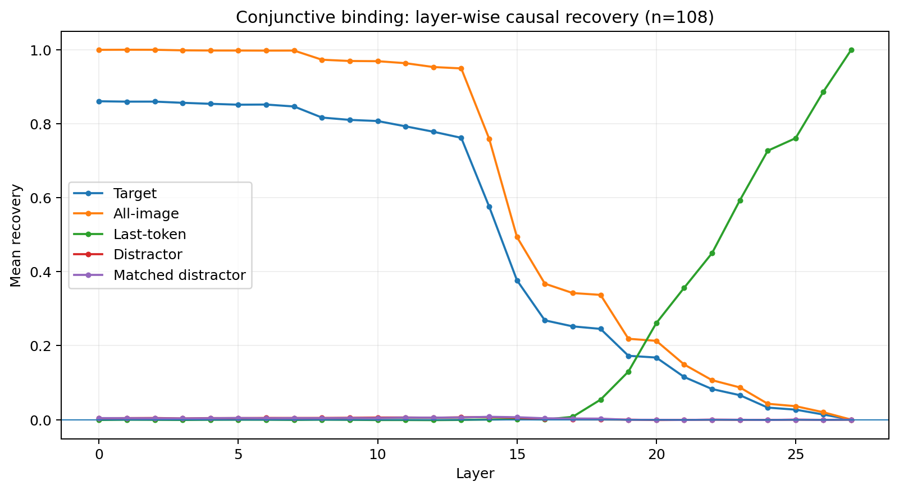
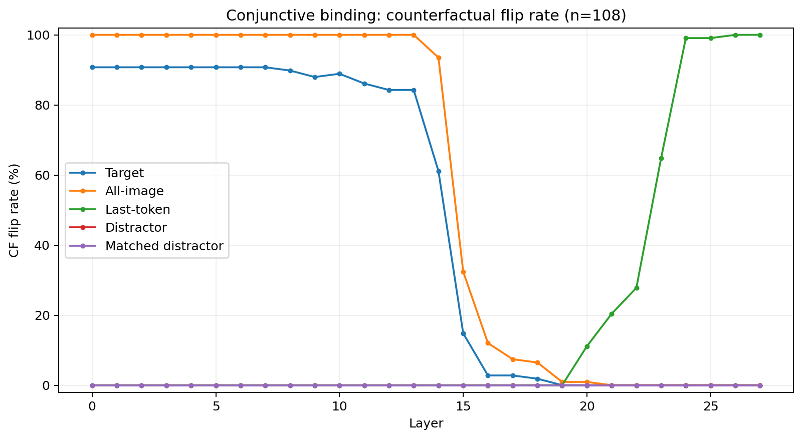
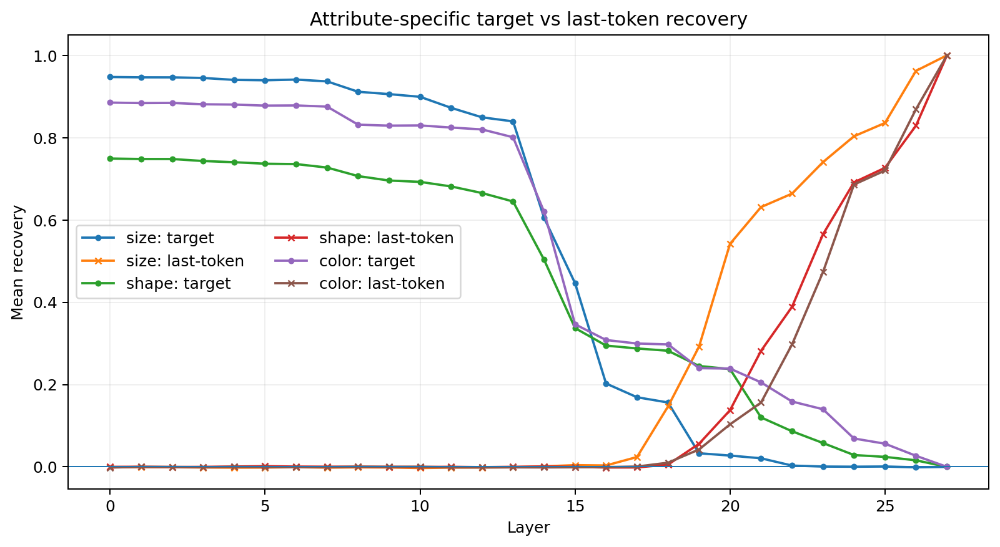
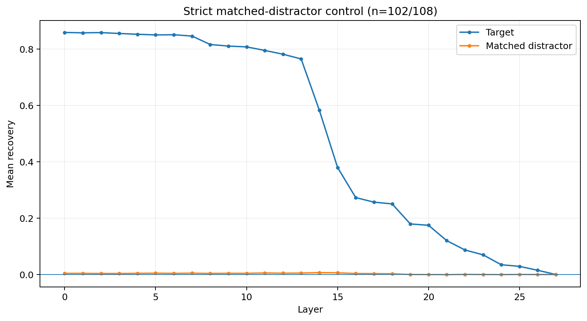
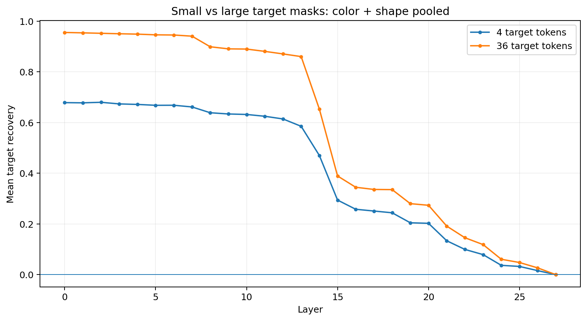
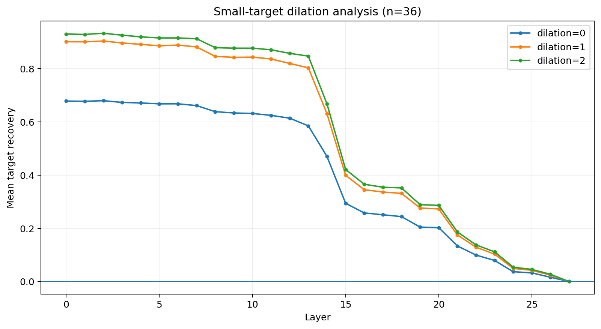

# Experimental Results

This file records verified experimental results for the VLM multi-feature binding project.  
Numbers below are copied or recomputed from the exact result CSVs used in the experiments. Results from different dataset generations are kept separate and should not be compared as if they were the same benchmark.

## 1. Legacy initial baseline — Qwen2.5-VL-3B

These are the original baseline numbers already recorded in the repository for the first binary-size dataset/generator. The condition names belong to that earlier setup and are **not** the current `synth_v4` condition hierarchy.

| Condition | Accuracy |
|---|---:|
| `unique_shape` | 95.37% |
| `multi_same_shape` | 96.30% |
| `compositional_distractor` | 90.74% |

Initial observation: removing the medium-size label reduced ambiguity and the 3B model was near ceiling on the first two conditions, while the compositional distractor condition produced a modest accuracy drop.

> The exact CSV/output for this legacy 3B baseline is not currently included in the material available here; these three values come from the repository's original `notes/baseline_results.md`. If the raw 3B result CSVs still exist, add them under `results/legacy_qwen3b/` for reproducibility.

## 2. Current controlled dataset — `synth_v4`

Current hierarchy:

1. `redundant_cues`
2. `single_cue_ambiguous`
3. `conjunctive_binding`

For `n=108`, `--query_attribute mixed` gives 36 size, 36 color, and 36 shape questions.

The detailed causal results below are currently for **`conjunctive_binding` only**. I do not currently have verified full baseline/patching CSVs for the other two `synth_v4` conditions, so no numbers are reported for them here.

## 3. Qwen2.5-VL-7B counterfactual endpoint check — conjunctive binding

Model: `Qwen2.5-VL-7B-Instruct`

Pairs: 108 total, 36 per queried attribute.

Verified endpoint behavior:

- clean accuracy: **100%**
- counterfactual accuracy: **100%**
- clean/CF correct answer changes: **100%**
- prediction-changed rate: **100%**
- usable-for-patching rate: **100%**

Thus all 108 pairs form valid golden clean/counterfactual pairs for the causal intervention study.

## 4. Full activation-patching sweep — 108 pairs × 28 LM layers

Interventions:

- `target`
- `all_image`
- `last_token`
- `distractor`
- `matched_distractor`

Dilation: `0`

Recovery is computed per sample as:

```text
gap = score(CF answer) - score(clean answer)

recovery =
    (patched_gap - clean_gap)
    / (cf_gap - clean_gap)
```

`CF flip rate` is the fraction of patched examples whose candidate prediction matches the counterfactual answer.

### Full layer-wise table

| Layer   |   Target Recovery | Target Flip   |   All-image Recovery | All-image Flip   | Last-token Recovery   | Last-token Flip   |   Distractor Recovery | Distractor Flip   |   Matched distractor Recovery | Matched distractor Flip   | Last−Target   |
|:--------|------------------:|:--------------|---------------------:|:-----------------|:----------------------|:------------------|----------------------:|:------------------|------------------------------:|:--------------------------|:--------------|
| Input   |             0.859 | 90.7%         |                1     | 100.0%           | —                     | —                 |                 0.004 | 0.0%              |                         0.003 | 0.0%                      | —             |
| L0      |             0.861 | 90.7%         |                1     | 100.0%           | -0.001                | 0.0%              |                 0.004 | 0.0%              |                         0.004 | 0.0%                      | -0.861        |
| L1      |             0.859 | 90.7%         |                1     | 100.0%           | -0.000                | 0.0%              |                 0.004 | 0.0%              |                         0.004 | 0.0%                      | -0.860        |
| L2      |             0.86  | 90.7%         |                1     | 100.0%           | -0.000                | 0.0%              |                 0.005 | 0.0%              |                         0.004 | 0.0%                      | -0.860        |
| L3      |             0.856 | 90.7%         |                0.998 | 100.0%           | -0.001                | 0.0%              |                 0.003 | 0.0%              |                         0.003 | 0.0%                      | -0.857        |
| L4      |             0.854 | 90.7%         |                0.998 | 100.0%           | -0.000                | 0.0%              |                 0.004 | 0.0%              |                         0.004 | 0.0%                      | -0.854        |
| L5      |             0.851 | 90.7%         |                0.998 | 100.0%           | -0.000                | 0.0%              |                 0.004 | 0.0%              |                         0.005 | 0.0%                      | -0.851        |
| L6      |             0.852 | 90.7%         |                0.997 | 100.0%           | -0.000                | 0.0%              |                 0.005 | 0.0%              |                         0.004 | 0.0%                      | -0.852        |
| L7      |             0.846 | 90.7%         |                0.998 | 100.0%           | -0.001                | 0.0%              |                 0.005 | 0.0%              |                         0.004 | 0.0%                      | -0.847        |
| L8      |             0.816 | 89.8%         |                0.973 | 100.0%           | -0.000                | 0.0%              |                 0.005 | 0.0%              |                         0.004 | 0.0%                      | -0.817        |
| L9      |             0.81  | 88.0%         |                0.969 | 100.0%           | -0.001                | 0.0%              |                 0.005 | 0.0%              |                         0.004 | 0.0%                      | -0.811        |
| L10     |             0.807 | 88.9%         |                0.969 | 100.0%           | -0.001                | 0.0%              |                 0.006 | 0.0%              |                         0.004 | 0.0%                      | -0.808        |
| L11     |             0.793 | 86.1%         |                0.963 | 100.0%           | -0.001                | 0.0%              |                 0.006 | 0.0%              |                         0.006 | 0.0%                      | -0.794        |
| L12     |             0.778 | 84.3%         |                0.953 | 100.0%           | -0.001                | 0.0%              |                 0.005 | 0.0%              |                         0.005 | 0.0%                      | -0.779        |
| L13     |             0.762 | 84.3%         |                0.949 | 100.0%           | -0.001                | 0.0%              |                 0.006 | 0.0%              |                         0.006 | 0.0%                      | -0.762        |
| L14     |             0.576 | 61.1%         |                0.76  | 93.5%            | 0.000                 | 0.0%              |                 0.007 | 0.0%              |                         0.008 | 0.0%                      | -0.576        |
| L15     |             0.377 | 14.8%         |                0.494 | 32.4%            | 0.001                 | 0.0%              |                 0.005 | 0.0%              |                         0.007 | 0.0%                      | -0.376        |
| L16     |             0.268 | 2.8%          |                0.368 | 12.0%            | 0.000                 | 0.0%              |                 0.002 | 0.0%              |                         0.004 | 0.0%                      | -0.268        |
| L17     |             0.252 | 2.8%          |                0.342 | 7.4%             | 0.008                 | 0.0%              |                 0.001 | 0.0%              |                         0.003 | 0.0%                      | -0.244        |
| L18     |             0.245 | 1.9%          |                0.337 | 6.5%             | 0.054                 | 0.0%              |                 0     | 0.0%              |                         0.003 | 0.0%                      | -0.191        |
| L19     |             0.173 | 0.0%          |                0.219 | 0.9%             | 0.130                 | 0.0%              |                 0     | 0.0%              |                        -0     | 0.0%                      | -0.043        |
| L20     |             0.168 | 0.0%          |                0.213 | 0.9%             | 0.261                 | 11.1%             |                -0.001 | 0.0%              |                        -0     | 0.0%                      | +0.093        |
| L21     |             0.115 | 0.0%          |                0.149 | 0.0%             | 0.356                 | 20.4%             |                -0.001 | 0.0%              |                        -0.001 | 0.0%                      | +0.241        |
| L22     |             0.083 | 0.0%          |                0.107 | 0.0%             | 0.450                 | 27.8%             |                -0     | 0.0%              |                         0     | 0.0%                      | +0.367        |
| L23     |             0.066 | 0.0%          |                0.087 | 0.0%             | 0.593                 | 64.8%             |                -0     | 0.0%              |                        -0     | 0.0%                      | +0.527        |
| L24     |             0.033 | 0.0%          |                0.043 | 0.0%             | 0.727                 | 99.1%             |                -0.001 | 0.0%              |                        -0.001 | 0.0%                      | +0.694        |
| L25     |             0.027 | 0.0%          |                0.036 | 0.0%             | 0.761                 | 99.1%             |                 0     | 0.0%              |                        -0     | 0.0%                      | +0.734        |
| L26     |             0.014 | 0.0%          |                0.02  | 0.0%             | 0.887                 | 100.0%            |                -0     | 0.0%              |                        -0.001 | 0.0%                      | +0.873        |
| L27     |             0     | 0.0%          |                0     | 0.0%             | 1.000                 | 100.0%            |                 0     | 0.0%              |                         0     | 0.0%                      | +1.000        |

### Headline pattern

- Early/mid layers: target-region intervention is strongly causal. At **L0**, mean target recovery is **0.861** and CF flip rate is **90.7%**.
- The target effect remains high through roughly **L13** (`0.762` recovery), then drops sharply around **L14–L16**.
- `all_image` shows the same qualitative mid-layer decline, so the transition is not explained only by a too-small target mask.
- `last_token` is nearly neutral in early layers, rises from the late-middle stack, and overtakes target recovery at **L20** overall.
- At **L24**, last-token recovery is **0.727** with **99.1%** CF flip rate.
- Both distractor controls remain near zero and never produce CF flips.

The safe interpretation is a **shift in causal recoverability** from visual-token positions toward the final prompt-token state. This is not by itself proof that a single representation literally moves between those locations.





## 5. Attribute-specific crossover

First layer where mean `Last-token recovery − Target recovery >= 0`:

| Attribute   | First crossover   |   Target recovery |   Last-token recovery |   Last−Target |
|:------------|:------------------|------------------:|----------------------:|--------------:|
| size        | L19               |             0.033 |                 0.292 |         0.259 |
| shape       | L21               |             0.12  |                 0.282 |         0.162 |
| color       | L22               |             0.159 |                 0.297 |         0.138 |

This establishes that the layerwise dynamics are not identical across queried attributes in this controlled dataset. The safe claim is that size shows an earlier crossover than shape and color; it should not be phrased as proof that “size reasoning finishes earlier.”



## 6. Matched-distractor control

`matched_distractor` is a target-disjoint control region anchored on a distractor. Here, “exact shape” means the **same rectangular mask dimensions on the image-token grid**, not the same semantic object shape such as square/circle.

Full-run strategies:

| Strategy | Number of samples |
|---|---:|
| `exact_shape_preferred_object` | 92 |
| `exact_shape_alternate_object` | 10 |
| `exact_count_reshaped_preferred_object` | 6 |

Strict matched-control definition:

- same grid-mask shape as target,
- same token count,
- zero overlap with target.

**102 / 108** samples satisfy this strict definition.

Across the strict matched controls:

- maximum absolute layer-mean recovery = **0.0067** at **L14**
- CF flip rate = **0% at every layer**

Therefore the large target effect is not explained by patching an equal-size/equal-shape visual region at a non-target object location.



## 7. Target-mask size analysis: 4 vs 36 tokens

For color and shape queries, small targets map to a 4-token raw bbox and large targets map to a 36-token raw bbox. Size queries are excluded from this comparison because the size-swap intervention uses the union of clean/CF target boxes, which yields a 36-token mask for every size pair.

Selected results:

| Attribute   | Layer   |   4 tokens |   36 tokens |
|:------------|:--------|-----------:|------------:|
| color       | L0      |      0.797 |       0.974 |
| color       | L8      |      0.748 |       0.915 |
| color       | L12     |      0.735 |       0.905 |
| color       | L14     |      0.554 |       0.686 |
| color       | L16     |      0.279 |       0.338 |
| color       | L20     |      0.214 |       0.264 |
| shape       | L0      |      0.561 |       0.938 |
| shape       | L8      |      0.53  |       0.883 |
| shape       | L12     |      0.493 |       0.837 |
| shape       | L14     |      0.386 |       0.621 |
| shape       | L16     |      0.237 |       0.352 |
| shape       | L20     |      0.192 |       0.283 |

The difference is especially large for shape. However, this comparison alone does **not** isolate token-count causally because 4-token and 36-token groups also correspond to small and large objects. This motivated the paired dilation experiment below.



## 8. Paired small-target dilation experiment

Purpose: test whether the lower recovery for small objects is mainly caused by the raw 4-token bbox missing part of the target-related causal footprint.

The exact same 36 small-target samples are used throughout:

- 18 color queries
- 18 shape queries

Only the patched spatial region is expanded:

- dilation 0: 4 target tokens
- dilation 1: 16 target-region tokens
- dilation 2: 36 target-region tokens

The new run evaluates `target` and `matched_distractor` at dilations 1 and 2; dilation-0 values are taken from the full run on the same samples.

### Overall small-target results

| Layer   |   d0 recovery | d0 flip   |   d1 recovery | d1 flip   |   d2 recovery | d2 flip   |
|:--------|--------------:|:----------|--------------:|:----------|--------------:|:----------|
| L0      |         0.679 | 77.8%     |         0.902 | 100.0%    |         0.931 | 100.0%    |
| L8      |         0.639 | 75.0%     |         0.847 | 100.0%    |         0.88  | 100.0%    |
| L12     |         0.614 | 69.4%     |         0.82  | 97.2%     |         0.858 | 100.0%    |
| L14     |         0.47  | 30.6%     |         0.631 | 72.2%     |         0.668 | 88.9%     |
| L16     |         0.258 | 0.0%      |         0.345 | 8.3%      |         0.366 | 8.3%      |
| L18     |         0.244 | 0.0%      |         0.332 | 5.6%      |         0.352 | 8.3%      |
| L20     |         0.203 | 0.0%      |         0.273 | 0.0%      |         0.286 | 0.0%      |

Key observations:

- L0 recovery: **0.679 → 0.902 → 0.931**
- L12 recovery: **0.614 → 0.820 → 0.858**
- L14 recovery: **0.470 → 0.631 → 0.668**
- Most of the gain occurs from dilation 0 to dilation 1; dilation 2 adds a smaller improvement.
- Matched-distractor interventions of comparable spatial size remain near zero.

Interpretation: for small objects, the target-related causal representation is **not confined to the raw object bbox tokens**. A one-token-ring expansion recovers most of the missing causal effect. The cautious wording is that the target-related representation is **spatially contextualized beyond the raw bbox**; this does not prove a uniquely localized object representation.

The main early-visual → late-last-token transition remains present after dilation, so that transition is not an artifact of the 4-token small-object mask.



## 9. Current conclusions

1. Counterfactual target information has strong causal leverage at target-associated visual positions in early/mid LM layers.
2. There is a sharp decline in visual-position recoverability around L14–L16.
3. Last-token causal recoverability rises later and becomes dominant; the overall target/last-token crossover is around L20.
4. This crossover differs by queried attribute: size L19, shape L21, color L22.
5. Raw and matched distractor controls are near zero, supporting target-location specificity.
6. For small objects, raw bbox patching substantially underestimates causal footprint; dilation 1 recovers most of the gap.
7. Current clean/CF construction changes the queried attribute of the target, so it is **not yet a pure binding-specific association intervention**. An association-swap counterfactual that preserves the feature multiset is a natural next step.
8. The next main comparison is to run the same causal pipeline on `redundant_cues` and `single_cue_ambiguous`, enabling a paired test of whether increasing binding demand changes the internal causal dynamics.

## 10. Reproducibility files

Core raw result files used for the results above:

```text
results/conjunctive_counterfactuals.csv
results/conjunctive_patching_full.csv
results/conjunctive_patching_full.csv.meta.json
results/conjunctive_small_target_dilation12.csv
results/conjunctive_small_target_dilation12.csv.meta.json
```

Detailed notebook/report outputs should be regenerated from the raw CSVs rather than treated as primary data.
